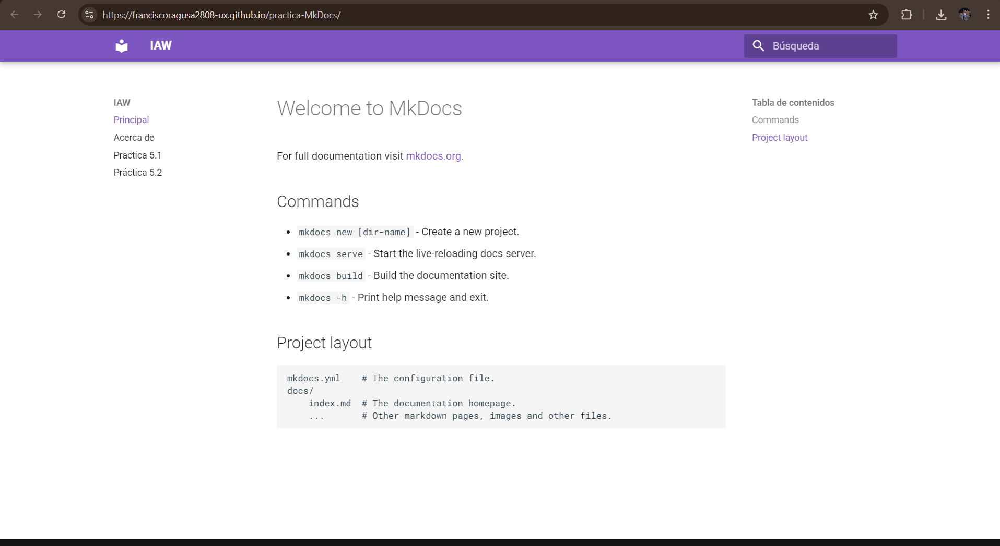
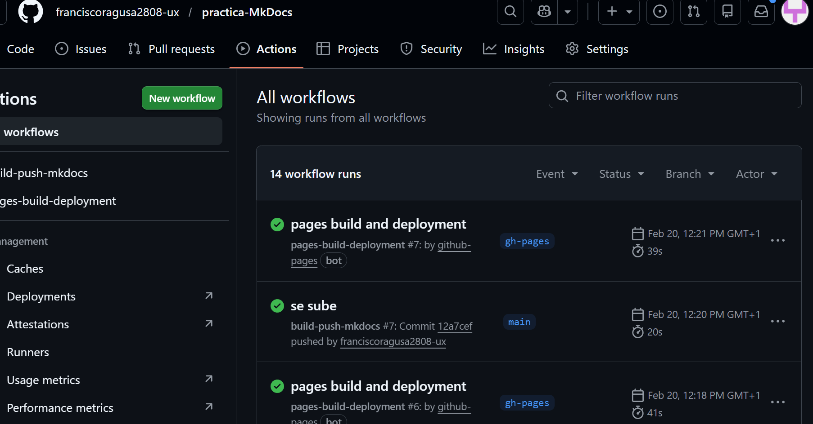

# Práctica MkDocs

En esta práctica se ha utilizado **MkDocs** para crear una página de documentación y publicarla en **GitHub Pages**.

El objetivo es generar un sitio web de documentación a partir de archivos Markdown y que se publique automáticamente usando **GitHub Actions**.

## Estructura del proyecto


```
practica-MkDocs/
│
├── .github/
│ └── workflows/
│ └── build-push-mkdocs.yml
│
├── docs/
│ └── index.md
│
├── mkdocs.yml
└── README.md
```


## Crear el proyecto

Primero se instala mkdocs:

```
pip install mkdocs
```


Después se crea el proyecto:
```
mkdocs new .
```


Esto genera la carpeta **docs** y el archivo **mkdocs.yml**.

## Publicación automática

Se ha creado un workflow en **GitHub Actions** para que cuando se haga un **push al repositorio** se construya la documentación y se publique automáticamente en **GitHub Pages**.

## Comprobación

La documentación publicada se puede ver en:

```
https://franciscoragusa2808-ux.github.io/practica-MkDocs/
```



También se puede comprobar en la pestaña **Actions** que el workflow se ejecuta correctamente.

