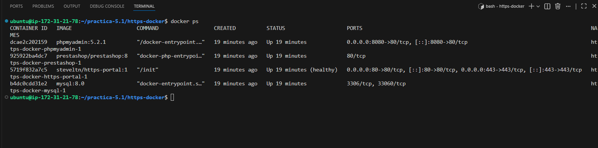
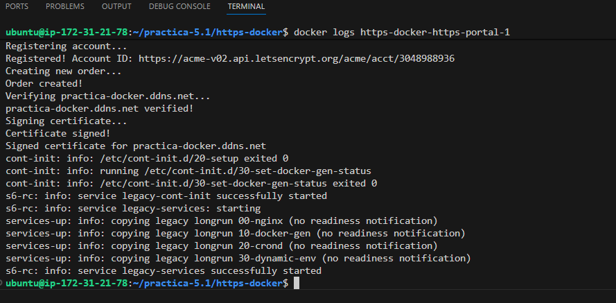
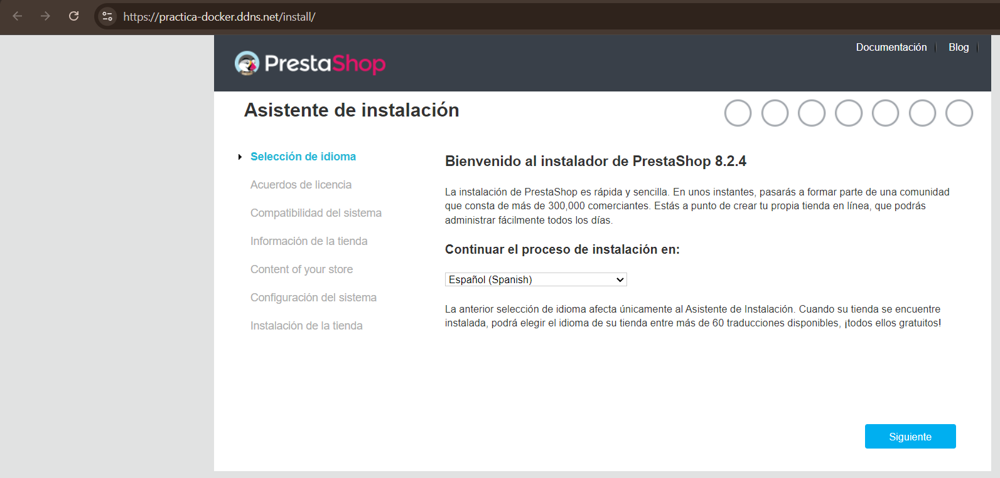
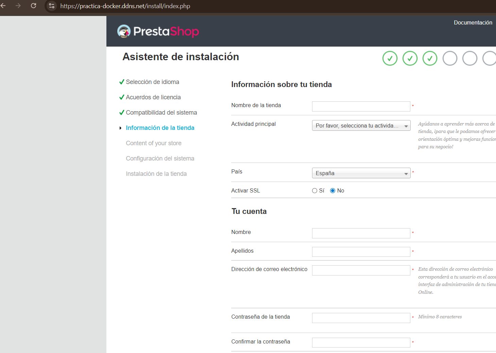
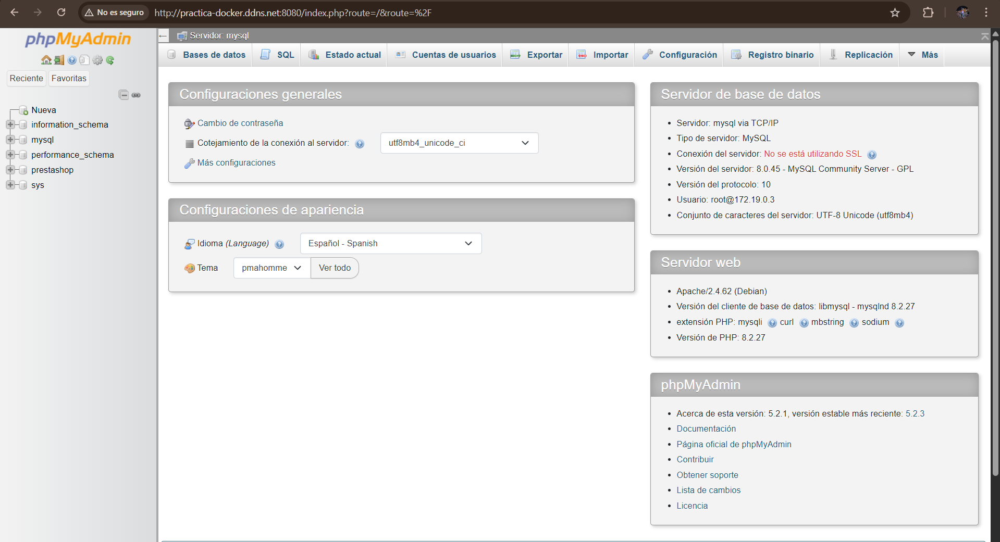

# Practica-5.1-https-docker

En esta práctica se realiza el despliegue de PrestaShop utilizando Docker.

Se configura MySQL,phpMyAdmin y HTTPS automático con Let’s Encrypt usando HTTPS-Portal.

El objetivo es tener una aplicación web funcionando con HTTPS sin configurar manualmente Nginx ni Certbot.

La estructura de la practica es la siguiente:
```
practica-5.1/
│
├── imagenes/
│
├── https-docker/
│   ├── .env
|   ├── env.example
│   └── docker-compose.yml
│
├── install_docker.sh
│
├── web/
│   └── index.html
│
└── README.md
```

## Directorio https-docker

Aquí están los archivos necesarios para levantar los contenedores con Docker Compose.
```
https-docker/
│   ├── .env
│   └── docker-compose.yml
```
### .env 
Este archivo contiene todas las variables usadas en cada script.Por motivos seguridad no se sube al repositorio, ya que contiene mi infromación personal. .En su lugar debes usar la plantilla .env.example y se copia de la siguiente forma:

```
cp .env.example .env
```


### docker-compose.yml

Define los siguientes contenedores:

**mysql**

- Base de datos de PrestaShop.
- Guarda los datos en un volumen persistente.

**phpmyadmin**

- Permite gestionar la base de datos desde el navegador.
- Se accede por el puerto 8080.

**prestashop** 

- Aplicación web principal.
- Se conecta a MySQL mediante la red interna.

**https-portal**

- Gestiona el HTTPS automáticamente.
- Expone los puertos 80 y 443.
- Solicita el certificado a Let’s Encrypt y lo renueva automáticamente.
- Redirige el tráfico hacia PrestaShop.


# Dominio 
Se utiliza un dominio gratuito de No-IP definido en la variable DOMAIN del archivo .env.

Este dominio es el que se usa para acceder a la aplicación.


El orden de ejecución es el siguiente:

Se levanta los contenedores con :

```
docker compose up -d
```


Se comprueba el estado de los contenedores con:

```
docker ps
```


Se observa la generación del certificado con :

```
docker logs https-docker-https-portal-1

```



Resultado:

Si accedemos al dominio se muestra la página de inicio de prestashop:





Acceso a phpmyAdmin
