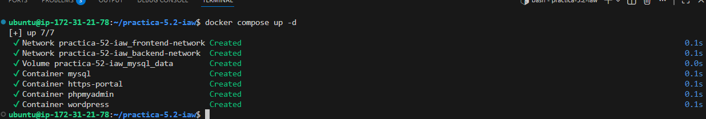
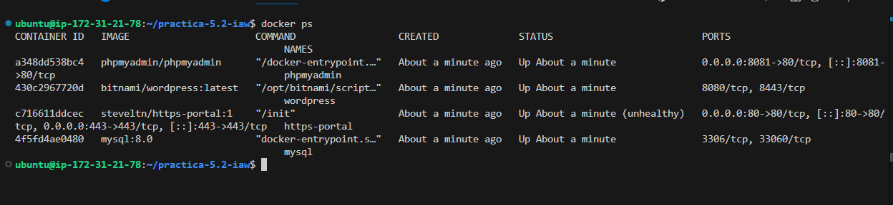
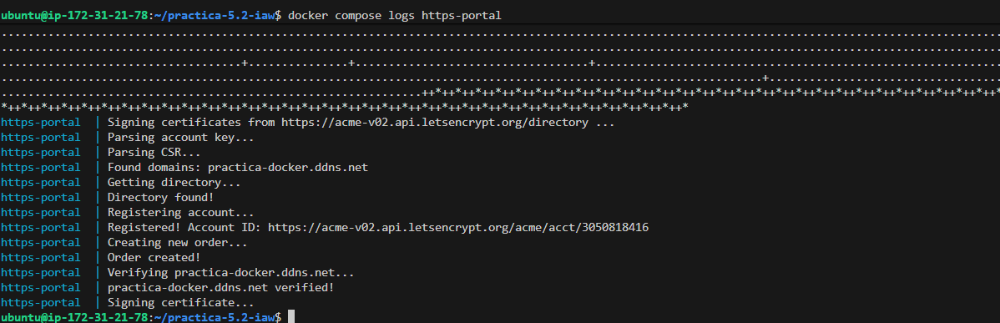
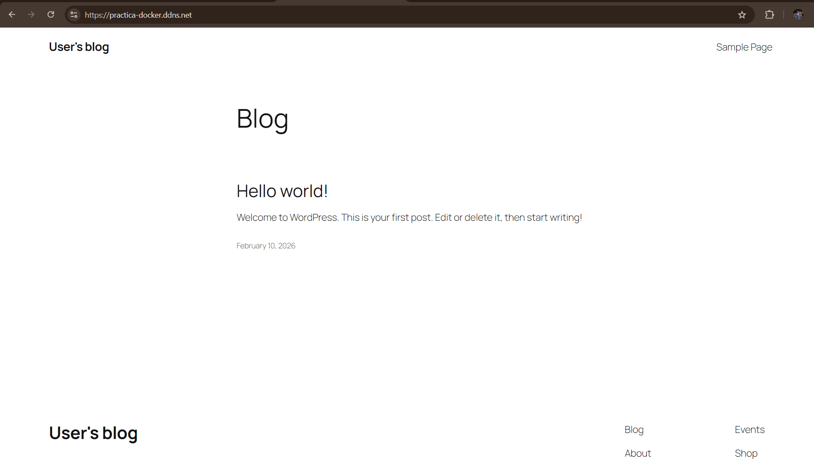
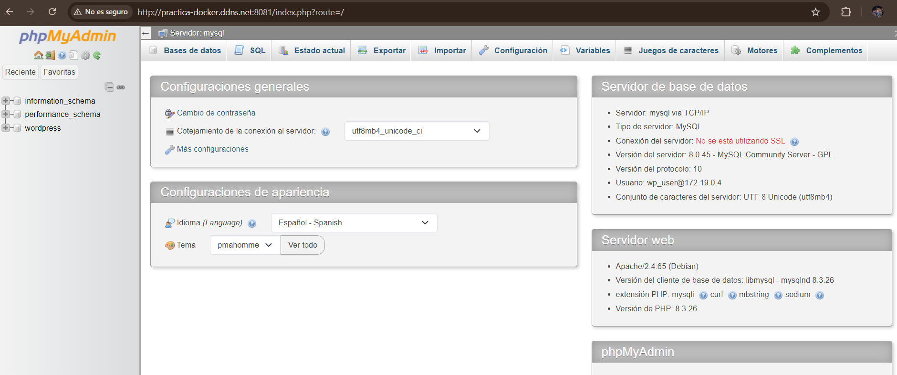

# Practica-5.2-wordpress-docker

En esta práctica se realiza el despliegue de WordPress utilizando Docker.

Se configura MySQL, phpMyAdmin y HTTPS automático con Let’s Encrypt usando HTTPS-Portal.

El objetivo es tener una aplicación web funcionando con HTTPS sin configurar manualmente Nginx ni Certbot.

La estructura de la practica es la siguiente:
```
practica-5.2/
│
├── imagenes/
│
├── wordpress-docker/
│   ├── .env
│   ├── env.example
│   └── docker-compose.yml
│
└── README.md
```

## Directorio wordpress-docker

Aquí están los archivos necesarios para levantar los contenedores con Docker Compose.
```
wordpress-docker/
│   ├── .env
│   └── docker-compose.yml
```

### .env

Este archivo contiene todas las variables usadas en cada script. Por motivos de seguridad no se sube al repositorio, ya que contiene mi información personal. En su lugar debes usar la plantilla .env.example y se copia de la siguiente forma:
```
cp .env.example .env
```

### docker-compose.yml

Define los siguientes contenedores:

**mysql**

- Base de datos de WordPress.
- Guarda los datos en un volumen persistente.

**phpmyadmin**

- Permite gestionar la base de datos desde el navegador.
- Se accede por el puerto 8081.

**wordpress**

- Aplicación web principal.
- Se conecta a MySQL mediante la red interna.

**https-portal**

- Gestiona el HTTPS automáticamente.
- Expone los puertos 80 y 443.
- Solicita el certificado a Let’s Encrypt y lo renueva automáticamente.
- Redirige el tráfico hacia WordPress.


## Dominio

Se utiliza un dominio gratuito de No-IP definido en la variable domain del archivo .env.

Este dominio es el que se usa para acceder a la aplicación.


El orden de ejecución es el siguiente:

Se levantan los contenedores con:
```
docker compose up -d
```



Se comprueba el estado de los contenedores con:
```
docker ps
```


Se observa la generación del certificado con:
```
docker compose logs https-portal
```


Resultado:

Si accedemos al dominio se muestra la página de inicio de WordPress:




Acceso a phpMyAdmin:

